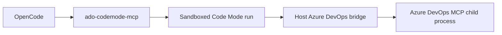

# ado-codemode-mcp

`ado-codemode-mcp` is a local MCP server that exposes a minimal Azure DevOps execution surface to OpenCode:

- `search`
- `execute`

By default, debug-style endpoints such as `health` and `list_capabilities` stay hidden. To expose them for local troubleshooting, start `ado-codemode-mcp` with:

```bash
export ADO_CODEMODE_MCP_EXPOSE_DEBUG_TOOLS=1
```

## What it does

- starts the Azure DevOps MCP process on the host
- keeps Azure DevOps credentials outside the sandbox
- runs generated JavaScript in a fresh sandbox per request
- exposes only two sandbox helpers to generated code:
  - `codemode.azdoListTools({})`
  - `codemode.azdoCallTool({ tool, args })`

## Flow at a glance



## Recommended usage pattern

Use `search` first when the model needs to discover tool names or capability shape.

Use `execute` for the real task, and prefer one combined program per task. Inside that one program:

- make multiple Azure DevOps helper calls as needed
- do lightweight aggregation, filtering, and shaping there
- return compact JSON-friendly output

Avoid splitting one task across many top-level `execute` calls unless:

- the result would exceed sandbox limits
- the task needs a deliberate checkpoint
- you are debugging a failing step in isolation

The endpoint descriptions in the MCP server intentionally reinforce this pattern so planner models are nudged toward one combined execute call where possible.

## Local runtime model

The current local-first implementation uses:

- `podman` by default
- `runsc` by default
- `--network=none`
- a file-backed callback channel between the sandbox and host bridge

The default sandbox limits are intentionally higher than the first prototype:

- timeout: 120s
- callback timeout: 30s
- logs: 128 KB
- result: 256 KB
- callbacks: 200

These can still be overridden with env vars:

- `CODEMODE_SANDBOX_TIMEOUT_MS`
- `CODEMODE_SANDBOX_CALLBACK_TIMEOUT_MS`
- `CODEMODE_SANDBOX_MAX_LOG_BYTES`
- `CODEMODE_SANDBOX_MAX_RESULT_BYTES`
- `CODEMODE_SANDBOX_MAX_CALLBACKS`

## Production-style direction

This repo is local-first, but the intended shape for a production-like deployment is similar:

- a trusted gateway service owns Azure DevOps MCP startup and credentials
- generated code runs in an isolated sandbox tier
- only a narrow callback API crosses from sandbox to host
- sandbox egress stays disabled unless explicitly needed
- audit logging and policy checks sit at the gateway boundary

For a future AKS deployment, the local `runsc` setup can evolve into a remote sandbox tier backed by Kata Containers, while keeping the same logical split:

- OpenCode or another planner calls the gateway
- the gateway dispatches generated code to an isolated sandbox worker
- the gateway remains the only component allowed to talk to Azure DevOps MCP with credentials
