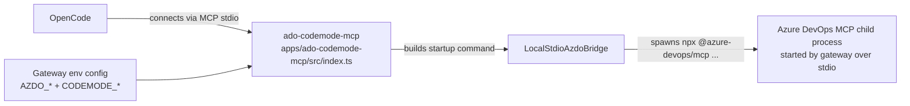

# Architecture

This repo adds a local MCP wrapper that places Code Mode orchestration between OpenCode and `ado-codemode-mcp`, which manages an Azure DevOps MCP child process.

## Trust boundaries

- `apps/ado-codemode-mcp/src/index.ts` is the trusted `ado-codemode-mcp` server OpenCode connects to.
- `packages/azdo-mcp-client/src/index.ts` is the trusted bridge that spawns the local Azure DevOps MCP server over stdio.
- `packages/azdo-mcp-client/src/config.ts` converts gateway environment variables into the Azure DevOps MCP startup command.
- `packages/sandbox-executor/src/GvisorContainerExecutor.ts` launches generated JavaScript in a fresh sandbox per run.
- `docker/sandbox-runner/entrypoint.mjs` is the minimal sandbox runtime that executes generated code and proxies host callbacks.

## Flow

1. OpenCode generates code and calls the gateway MCP tool `search` or `execute`.
2. The gateway exposes a narrow helper surface to Code Mode: `codemode.azdoListTools({})` and `codemode.azdoCallTool({ tool, args })`.
3. The gateway uses `@cloudflare/codemode` directly, with a custom executor that writes a per-run workspace and launches either Podman, Docker, or the explicit `process` fallback.
4. The runner executes the provided JavaScript inside the sandbox.
5. Host callbacks travel through a bind-mounted request/response directory in the run workspace, which keeps v1 compatible with `--network=none`.
6. The bridge forwards Azure DevOps tool calls to the Azure DevOps MCP process and returns sanitized results.

## Startup flow



## Execution flow

```mermaid
flowchart LR
    MODEL[OpenCode planner/model]
    GATEWAY[ado-codemode-mcp\nsearch / execute]
    CODEMODE[@cloudflare/codemode]
    SANDBOX[Sandbox executor\nPodman or Docker + runsc]
    CALLBACK[File-backed callback channel]
    BRIDGE[Host bridge]
    ADO[Azure DevOps MCP]

    MODEL -->|single combined execute call| GATEWAY
    GATEWAY --> CODEMODE
    CODEMODE --> SANDBOX
    SANDBOX -->|codemode.azdoListTools / azdoCallTool| CALLBACK
    CALLBACK --> BRIDGE
    BRIDGE --> ADO
    ADO --> BRIDGE --> CALLBACK --> SANDBOX
    SANDBOX --> GATEWAY --> MODEL
```

## Public tool surface

The production-style tool surface is intentionally small:

- `search`
- `execute`

Debug endpoints such as `health` and `list_capabilities` are only registered when `ADO_CODEMODE_MCP_EXPOSE_DEBUG_TOOLS=1` is set.

The intended model behavior is:

- call `search` to discover tool names and helper shape when needed
- use one combined `execute` call per task whenever practical
- perform lightweight shaping, aggregation, and filtering inside that single sandboxed program

## Gateway-owned Azure DevOps startup

OpenCode only starts `ado-codemode-mcp`. The gateway then starts Azure DevOps MCP itself using environment-driven configuration:

- `AZDO_ORGANIZATION`
- `AZDO_AUTHENTICATION`
- `AZDO_DOMAINS`
- `AZDO_TENANT`
- `AZDO_MCP_BINARY`

That keeps Azure DevOps MCP details out of the OpenCode MCP registry and avoids duplicate server entries.

## Why the callback channel is file-based

The checklist called for a narrow host callback path and also recommended `--network=none` for the sandbox. A file-backed callback queue satisfies both constraints:

- no general outbound network is needed from the sandbox
- host functions stay explicitly allowlisted
- each run gets its own isolated callback directory
- the host can cap callback count and inspect each request before forwarding it

## Current capability surface

The gateway now exposes the Azure DevOps MCP tool surface through the trusted bridge. That includes mutation tools, so the main safety controls are:

- sandbox isolation for generated code
- credentials remaining outside the sandbox
- a narrow callback API instead of general host access
- compact public MCP surface at the gateway boundary
