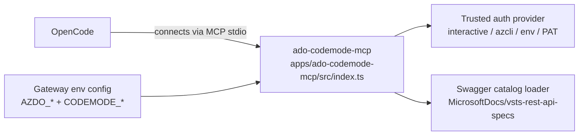

# Architecture

This repo now uses a direct Azure DevOps REST catalog instead of wrapping the Azure DevOps MCP server.

## Trust boundaries

- `apps/ado-codemode-mcp/src/index.ts` is the trusted `ado-codemode-mcp` server OpenCode connects to.
- `apps/ado-codemode-mcp/src/catalog.ts` loads and normalizes the public Azure DevOps Swagger specs into a searchable operation catalog.
- `apps/ado-codemode-mcp/src/auth.ts` and `apps/ado-codemode-mcp/src/org-tenant.ts` acquire Azure DevOps tokens in the trusted host process.
- `packages/sandbox-executor/src/GvisorContainerExecutor.ts` launches generated JavaScript in a fresh sandbox per run.
- `docker/sandbox-runner/entrypoint.mjs` is the minimal sandbox runtime that executes generated code and proxies host callbacks.

## Flow

1. OpenCode calls the gateway MCP tool `search` or `execute`.
2. `search` runs sandboxed JavaScript over a static Azure DevOps REST operation catalog derived from the official Swagger repo.
3. `execute` runs sandboxed JavaScript that can call one helper only: `codemode.azdoRequest(...)`.
4. The host helper performs authenticated Azure DevOps REST requests outside the sandbox and returns structured results.
5. The sandbox chains those responses inside one program and returns compact output to the model.

## Startup flow



## Execution flow

```mermaid
flowchart LR
    MODEL[OpenCode planner/model]
    GATEWAY[ado-codemode-mcp\nsearch / execute]
    CODEMODE[@cloudflare/codemode]
    SANDBOX[Sandbox executor\nPodman or Docker + runsc]
    CALLBACK[File-backed callback channel]
    API[Trusted Azure DevOps REST caller]
    ADO[Azure DevOps REST API]

    MODEL -->|single combined execute call| GATEWAY
    GATEWAY --> CODEMODE
    CODEMODE --> SANDBOX
    SANDBOX -->|codemode.azdoRequest| CALLBACK
    CALLBACK --> API
    API --> ADO
    ADO --> API --> CALLBACK --> SANDBOX
    SANDBOX --> GATEWAY --> MODEL
```

## Public tool surface

The normal tool surface remains intentionally tiny:

- `search`
- `execute`

Debug endpoints such as `health` and `list_capabilities` are only registered when `ADO_CODEMODE_MCP_EXPOSE_DEBUG_TOOLS=1` is set.

The intended model behavior is:

- call `search` once to narrow the relevant operationIds
- use one combined `execute` call per task whenever practical
- chain on `response.data` from earlier API calls inside that single sandboxed program

## Why the callback channel is still file-based

The current sandbox contract still uses a file-backed callback queue because it works cleanly with `--network=none`:

- no general outbound network is needed from the sandbox
- host functions stay explicitly allowlisted
- each run gets its own isolated callback directory
- the host can cap callback count and inspect each request before forwarding it

## Current capability surface

The gateway now exposes the Azure DevOps REST contract rather than a wrapped MCP tool catalog. That means the main safety controls are:

- sandbox isolation for generated code
- credentials remaining outside the sandbox
- a single trusted request helper instead of general host access
- compact public MCP surface at the gateway boundary
