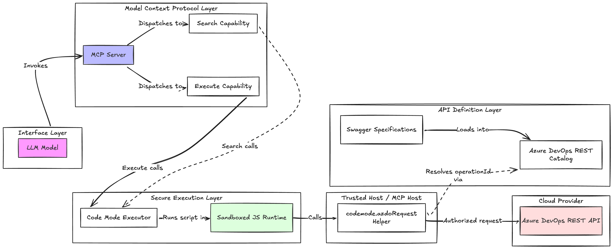
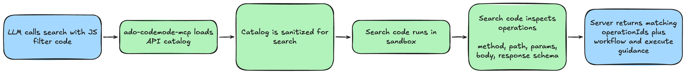
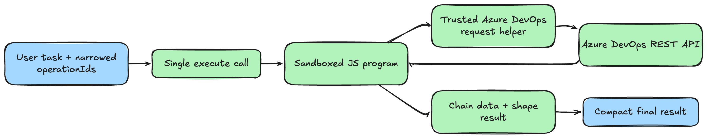
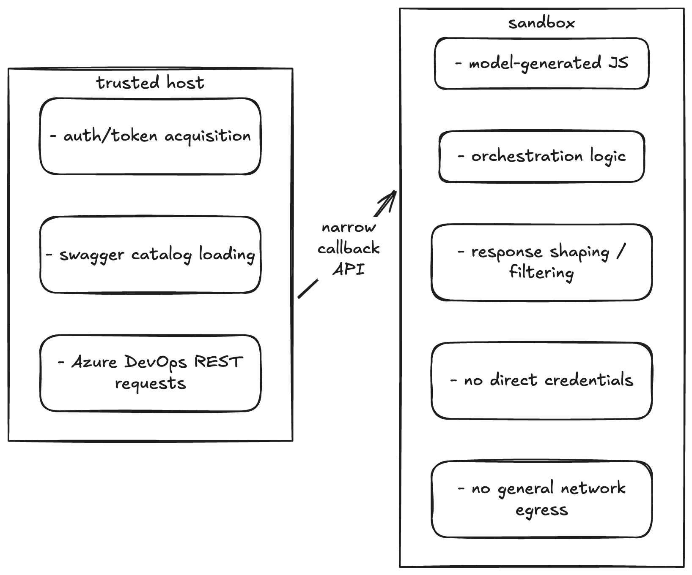
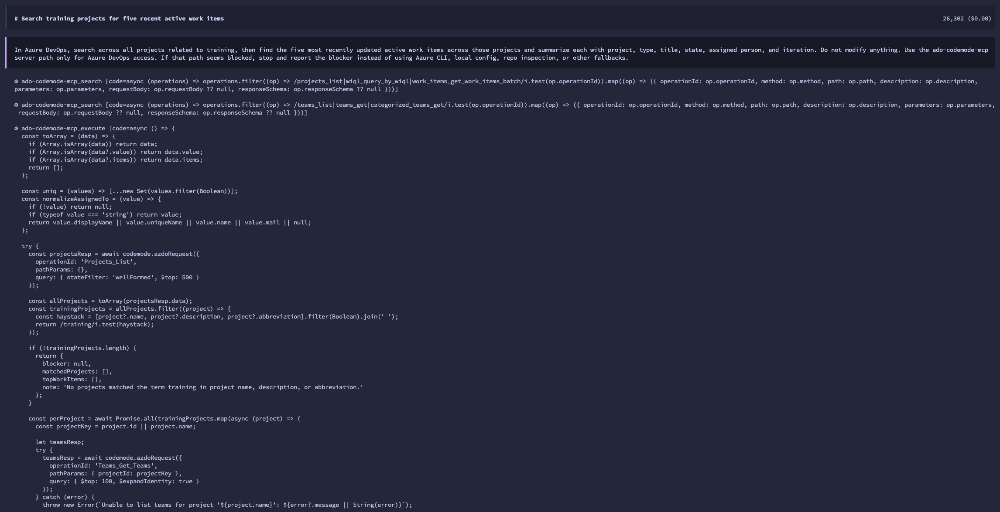
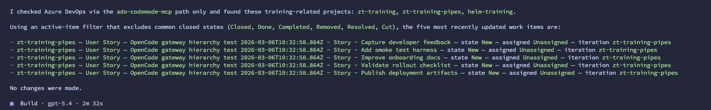

<div class="title-slide">
  <div class="title-slide__top">Pasi Huuhka, 2026</div>
  <div class="title-slide__rule"></div>

  # Going Code Mode: 
  ## the future of MCP servers
</div>

<!--
Quick intro. Set the tone: practical, not anti-MCP, not anti-Code Mode.
The story is about trying a promising pattern on a real ugly tool surface.
-->

---
layout: center
class: text-center
---

# Going Code Mode: the future of MCP servers

<div class="cfp-card mt-10 max-w-5xl mx-auto text-left">
  <div v-click class="cfp-card__meta">
    <span>Level 200-400</span>
    <span>code + architecture</span>
    <span>Azure-flavored case study</span>
  </div>

  <p v-click>
    A practical case study: Cloudflare Code Mode against Azure DevOps MCP.
  </p>

  <p v-click>
    The promise: search the surface, write one small program, return one useful result.
  </p>

  <p v-click>
    I will show why wrapping MCP was not enough, and why a direct REST contract worked better.
  </p>
</div>

---
layout: center
class: text-center
---

# The whole reason I tried this

<div class="text-2xl leading-tight max-w-4xl mx-auto mt-6 opacity-90">
Azure DevOps MCP exposed roughly <span class="text-cyan-300 font-bold">80 tools</span> by default.
</div>

<div class="grid grid-cols-2 gap-8 mt-12 text-left text-lg max-w-5xl mx-auto">
  <div v-click class="rounded-2xl bg-white/6 p-6">
    <div class="font-semibold mb-2">What that means in practice</div>
    <ul class="space-y-2 opacity-85">
      <li>tool descriptions eat tokens</li>
      <li>selection accuracy drops</li>
      <li>multi-step tasks get noisy fast</li>
    </ul>
  </div>
  <div v-click class="rounded-2xl bg-white/6 p-6">
    <div class="font-semibold mb-2">Why Code Mode looked perfect</div>
    <ul class="space-y-2 opacity-85">
      <li>search once</li>
      <li>write one small program</li>
      <li>return only the useful result</li>
    </ul>
  </div>
</div>

<!--
This is the emotional setup slide. Azure DevOps looked like a perfect candidate.
-->

---
layout: center
---

# Why MCP hurts

---
layout: two-cols
---

# MCP in one slide

<v-clicks>

- MCP gives models a standard way to access tools.
- That part is genuinely useful.
- The pain shows up when the tool surface gets large.
- Definitions pile up in context before the model does any real work.
- Then the model still has to choose correctly from a big surface.

</v-clicks>

::right::

```text
model
  |
  v
MCP client
  |
  +--> server A (12 tools)
  +--> server B (18 tools)
  +--> server C (35 tools)
  +--> server D (9 tools)

=> lots of tool definitions
=> lots of adjacent choices
=> lots of tokens before work starts
```

<!--
Keep MCP explanation simple. Don't over-explain protocol internals.
-->

---
layout: center
class: text-center
---

# The response pattern

<div class="mt-10 grid grid-cols-3 gap-6 max-w-6xl mx-auto text-left">
  <div v-click class="rounded-2xl bg-white/6 p-6">
    <div class="text-sm uppercase tracking-wide opacity-60">Step 1</div>
    <div class="text-2xl font-semibold mt-2">Skills</div>
    <div class="mt-3 opacity-80">Load less upfront.</div>
  </div>
  <div v-click class="rounded-2xl bg-white/6 p-6">
    <div class="text-sm uppercase tracking-wide opacity-60">Step 2</div>
    <div class="text-2xl font-semibold mt-2">Tool search</div>
    <div class="mt-3 opacity-80">Discover tools dynamically.</div>
  </div>
  <div v-click class="rounded-2xl bg-white/6 p-6">
    <div class="text-sm uppercase tracking-wide opacity-60">Step 3</div>
    <div class="text-2xl font-semibold mt-2">Programmatic calls</div>
    <div class="mt-3 opacity-80">Let code do the orchestration.</div>
  </div>
</div>

<div v-click="4" class="mt-12 text-lg opacity-80 max-w-4xl mx-auto no-ghost">
These are all converging on the same realization:
<span class="text-cyan-300 font-semibold">large tool surfaces need dynamic discovery and code-based orchestration.</span>
</div>

---
layout: default
clicks: 5
---
# Same pressure, different product shapes

<div class="grid grid-cols-2 gap-6 mt-8 text-lg max-w-6xl mx-auto">
  <div v-click class="rounded-2xl bg-white/6 p-6">
    <div class="flex items-center gap-3 mb-3">
      
      <div class="font-semibold text-xl">Cloudflare</div>
    </div>
    <div class="space-y-2 opacity-85">
      <div><span class="font-semibold opacity-95">Pattern:</span> Code Mode</div>
      <div><span class="font-semibold opacity-95">Move:</span> one typed code surface</div>
      <div><span class="font-semibold opacity-95">Runtime:</span> isolated Worker sandbox</div>
    </div>
  </div>
  <div v-click class="rounded-2xl bg-white/6 p-6">
    <div class="flex items-center gap-3 mb-3">
      
      <div class="font-semibold text-xl">Anthropic</div>
    </div>
    <div class="space-y-2 opacity-85">
      <div><span class="font-semibold opacity-95">Discovery:</span> tool search</div>
      <div><span class="font-semibold opacity-95">Execution:</span> programmatic tool calling</div>
      <div><span class="font-semibold opacity-95">Runtime:</span> code execution container</div>
    </div>
  </div>
  <div v-click class="rounded-2xl bg-white/6 p-6">
    <div class="flex items-center gap-3 mb-3">
      
      <div class="font-semibold text-xl">OpenAI</div>
    </div>
    <div class="space-y-2 opacity-85">
      <div><span class="font-semibold opacity-95">Discovery:</span> tool search</div>
      <div><span class="font-semibold opacity-95">Surface:</span> deferred namespaces / MCP</div>
      <div><span class="font-semibold opacity-95">Goal:</span> load less upfront</div>
    </div>
  </div>
  <div v-click class="rounded-2xl bg-white/6 p-6">
    <div class="flex items-center gap-3 mb-3">
      
      <div class="font-semibold text-xl">Google</div>
    </div>
    <div class="space-y-2 opacity-85">
      <div><span class="font-semibold opacity-95">Calling:</span> compositional function calling</div>
      <div><span class="font-semibold opacity-95">Runtime:</span> built-in code execution</div>
      <div><span class="font-semibold opacity-95">Direction:</span> more work inside one turn</div>
    </div>
  </div>
</div>

<div v-click="5" class="mt-8 text-base opacity-70 max-w-5xl mx-auto no-ghost">
  Not the same APIs, but the direction is familiar: shrink the upfront tool surface and let code handle more of the workflow.
</div>

<!--
Source trail:
- Cloudflare Codemode docs
- Anthropic tool search + programmatic tool calling docs
- OpenAI tool search docs
- Google Gemini function calling docs (including compositional function calling)
Apple CodeAct is the research ancestor worth naming out loud if helpful.
-->

---
layout: center
---

# Code Mode

---
layout: default
---

# README version

```ts {1-4|6-21|23-27|29-31}{maxHeight:'520px'}
import { createCodeTool } from "@cloudflare/codemode/ai";
import { DynamicWorkerExecutor } from "@cloudflare/codemode";
import { tool } from "ai";
import { z } from "zod";

// Create the tools
const tools = {
  getWeather: tool({
    description: "Get weather for a location",
    inputSchema: z.object({ location: z.string() }),
    execute: async ({ location }) => `Weather in ${location}: 72°F, sunny`
  }),
  sendEmail: tool({
    description: "Send an email",
    inputSchema: z.object({
      to: z.string(),
      subject: z.string(),
      body: z.string()
    }),
    execute: async ({ to, subject, body }) => `Email sent to ${to}`
  })
};

// Hopefully secure execution environment
const executor = new DynamicWorkerExecutor({
  loader: env.LOADER
});

// This is passed on to your models as the tool surface
const codemode = createCodeTool({ tools, executor });
```

---
layout: default
---

# What the model writes

```ts {1-2|3-8}{maxHeight:'460px'}
async () => {
  const weather = await codemode.getWeather({ location: "London" })
  if (weather.includes("sunny")) {
    await codemode.sendEmail({
      to: "team@example.com",
      subject: "Nice day!",
      body: `It's ${weather}`,
    })
  }
  return { weather, notified: true }
}
```

---
layout: center
class: text-center
---

# Why this pattern is appealing

<v-clicks>

- typed tool surface
- one bounded async function
- one useful result back


</v-clicks>

<div v-click class="mt-10 rounded-2xl bg-cyan-500/10 border border-cyan-300/20 p-6 text-xl leading-snug max-w-4xl mx-auto">
This is the pull: <span class="text-cyan-300 font-semibold">discover the right surface, chain the calls in code, return only the useful result.</span>
</div>
---
layout: center
class: text-center
---

# Why Azure DevOps fit

<div class="mt-8 text-2xl opacity-90 max-w-5xl mx-auto">
Big tool surface. Lots of adjacent tools. Real multi-step workflows.
</div>

<div class="mt-12 text-xl opacity-80 max-w-4xl mx-auto">
Exactly where plain tool calling starts to feel brittle.
</div>

---
layout: center
---

# First attempt

## Wrap MCP

---
layout: center
class: text-center
---

# The wrapped MCP version looked neat on paper

<div class="grid grid-cols-2 gap-6 mt-12 text-left text-lg max-w-5xl mx-auto">
  <div v-click class="rounded-2xl bg-white/6 p-6">
    <div class="font-semibold mb-2">What I expected</div>
    <div class="opacity-80">Search once. Execute once. Nice clean orchestration.</div>
  </div>
  <div v-click class="rounded-2xl bg-rose-500/10 border border-rose-300/20 p-6">
    <div class="font-semibold mb-2">What actually happened</div>
    <div class="opacity-85">A lot more churn, retries, and probing than I expected.</div>
  </div>
</div>

<div v-after class="mt-10 text-base opacity-65">Repo branch: `feat/mcp-wrap`</div>

---
layout: two-cols
---

# What went wrong in practice

<v-clicks>

- Wrapping MCP was easy.
- Reliable behavior was not.
- The model could call tools.
- It could not reliably reason about the outputs.

</v-clicks>

::right::

<v-clicks>

- repeated search calls
- repeated execute calls
- retries with slightly different arguments
- fallback behavior outside the intended path

</v-clicks>

<div v-after class="mt-8 rounded-2xl bg-amber-400/10 border border-amber-300/20 p-5 text-lg">
One task that should have been one execute call turned into something like <span class="font-semibold text-amber-200">18 execute calls</span>.
</div>

---
layout: center
class: text-center
---

# Why it failed

<div class="max-w-5xl mx-auto mt-8 text-2xl leading-snug opacity-90">
The wrapped MCP surface was not a strong enough contract.
</div>

<div class="grid grid-cols-2 gap-8 mt-12 text-left text-lg max-w-5xl mx-auto">
  <div v-click class="rounded-2xl bg-white/6 p-6">
    <div class="font-semibold mb-2">The model could see</div>
    <ul class="space-y-2 opacity-85">
      <li>tool names</li>
      <li>input schemas</li>
      <li>rough descriptions</li>
    </ul>
  </div>
  <div v-click class="rounded-2xl bg-white/6 p-6">
    <div class="font-semibold mb-2">The model often could not see</div>
    <ul class="space-y-2 opacity-85">
      <li>reliable return shapes</li>
      <li>useful structured outputs</li>
      <li>enough to confidently chain steps</li>
    </ul>
  </div>
</div>

---
layout: center
---

# Security

---
layout: two-cols
---

# Hosted story

<v-clicks>

- If you use Cloudflare Dynamic Workers, the sandboxing story is much cleaner.
- The README examples look pleasantly straightforward in that world.

</v-clicks>

::right::

# Self-managed story

<v-clicks>

- If you do not use hosted execution, you need a real plan.
- How do you run untrusted code?
- How do you block general network egress?
- How do you narrow host callbacks?

</v-clicks>

---
layout: quote
---

> People are already YOLO-running model-written code.<br><br>
> The execution boundary is where that gets dangerous fast.

---
layout: center
---

# The pivot

---
layout: default
---

# The direct REST contract version

<v-clicks>

- Microsoft publishes the Azure DevOps REST specs in `MicrosoftDocs/vsts-rest-api-specs`.
- They are split by area and version, not one giant file.
- But they are good enough to build a static operation catalog from.
- That was enough to switch from wrapped MCP tools to a direct REST contract.

</v-clicks>

<div v-after class="mt-10 rounded-2xl bg-cyan-500/10 border border-cyan-300/20 p-6 text-xl leading-snug">
Once the model could see both the inputs <span class="opacity-70">and</span> the output schemas, the whole system started behaving much better.
</div>

---
class: full-bleed
---

<div class="full-visual">
  
</div>

---
class: full-bleed
---

<div class="full-visual">
  
</div>

---
class: full-bleed
---

<div class="full-visual">
  
</div>

---
class: full-bleed
---

<div class="full-visual">
  
</div>

---
layout: two-cols
---

# Why this version worked better

<v-clicks>

- operation IDs
- path/query/body inputs
- request body shape
- response schema
- response examples the model can reason about

</v-clicks>

::right::

<v-clicks>

- less guessing
- fewer retries
- fewer fallback behaviors
- much better chance of one search + one execute
- much better chaining inside one bounded program

</v-clicks>

<div v-after class="mt-8 rounded-2xl bg-white/6 p-5 text-lg">
The direct REST catalog let the model reason about <span class="font-semibold text-cyan-300">data flow</span>, not just what to call next.
</div>

---
layout: quote
---

> Code Mode is at its best when the model can plan data flow, not just function calls.

---
layout: center
---

# Demo

---
layout: two-cols
---

# Demo part 1

## Old wrapped MCP version

<v-clicks>

- show `feat/mcp-wrap`
- show broad tool surface
- show churny task
- mention the 18 execute calls
- point out: the model could call things, but it could not reliably reason about the outputs

</v-clicks>

::right::

# Demo part 2

## Current direct REST version

<v-clicks>

- show `master`
- search operations, not wrapped MCP tools
- execute one combined program
- use a realistic read-only task across training-related projects
- point out the bounded behavior: usually 1-2 searches and 1 execute

</v-clicks>

---
class: full-bleed
---

<div class="full-visual full-visual--dark">
  
</div>

---
class: full-bleed
---

<div class="full-visual full-visual--dark">
  
</div>

---
layout: center
class: text-center
---

# What I learned

<div class="grid grid-cols-2 gap-8 mt-10 text-left text-lg max-w-6xl mx-auto">
  <div v-click class="rounded-2xl bg-white/6 p-6">
    <div class="font-semibold mb-2">Still true</div>
    <ul class="space-y-2 opacity-85">
      <li>Code Mode is a good idea.</li>
      <li>These patterns are clearly where the ecosystem is moving.</li>
      <li>Large tool surfaces really do need better handling.</li>
    </ul>
  </div>
  <div v-click class="rounded-2xl bg-white/6 p-6">
    <div class="font-semibold mb-2">What changed</div>
    <ul class="space-y-2 opacity-85">
      <li>Wrapping MCP is not automatically enough.</li>
      <li>Output schemas matter almost as much as input schemas.</li>
      <li>A strong contract beats prompt tricks.</li>
      <li>Prompts should not describe the underlying tools, rather how to use them effectively.</li>
    </ul>
  </div>
</div>

---
layout: quote
---

> Code Mode gets real when the model can plan data flow, not just function calls.

---
layout: center
class: text-center
---

# Links

<div class="grid grid-cols-2 gap-8 text-left max-w-6xl mx-auto mt-8 text-base leading-relaxed">
  <div v-click class="rounded-2xl bg-white/6 p-6">
    <div class="text-sm uppercase tracking-wide opacity-60 mb-3">Repos</div>
    <div class="space-y-3">
      <div>Current repo:<br><span class="text-cyan-300">github.com/DrBushyTop/ado-codemode-mcp/tree/master</span></div>
      <div>Wrapped MCP branch:<br><span class="text-cyan-300">github.com/DrBushyTop/ado-codemode-mcp/tree/feat/mcp-wrap</span></div>
      <div>Blog post:<br><span class="text-cyan-300">huuhka.net/testing-cloudflares-code-mode-on-azure-devops-mcp</span></div>
    </div>
  </div>
  <div v-click class="rounded-2xl bg-white/6 p-6">
    <div class="text-sm uppercase tracking-wide opacity-60 mb-3">References</div>
    <div class="space-y-3">
      <div>Cloudflare Code Mode README + presentation</div>
      <div>OpenAI tool search</div>
      <div>Claude tool search</div>
      <div>Claude programmatic tool calling</div>
      <div>Anthropic advanced tool use</div>
    </div>
  </div>
</div>

---
layout: center
class: text-center
---

# Thank you

<div class="mt-10 text-2xl">Questions?</div>

<div class="mt-10 text-lg opacity-75">
Slides, repo links, and the blog post will be shared.
</div>

<!--
Keep Q&A flexible. Good likely questions:
- Is MCP still worth it?
- Would I use wrapped MCP again?
- How much did sandboxing cost in complexity?
- What would I do differently from scratch?
-->
